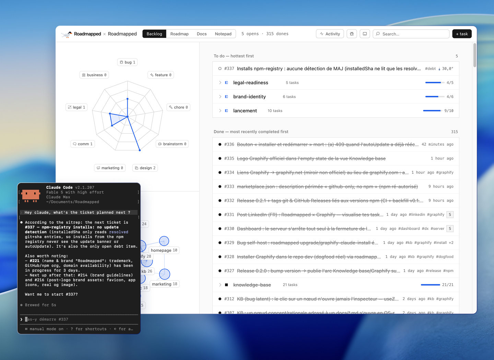

# Roadmapped

[](./LICENSE)

**Your repo becomes your project management tool.** Backlog, roadmap and docs live as
plain YAML/markdown files inside your repository — the only source of truth. Agent-first
by design: a CLI and a Claude skill let your AI agent create specs, tasks and dependencies
in the right format. No database, no SaaS, no account.



> **Naming** — the brand is **Roadmapped** (two p's, renamed 2026-07). The future GitHub
> repository must be created as `Roadmapped`. Host repos still using the legacy
> `roadmaped.config.json` (one p) keep working — the old filename is read as a fallback.

## Quickstart

```bash
npm install
npm run dev                  # dashboard on http://localhost:5173
node scripts/task.mjs --help # agent/human CLI over docs/tasks/
```

## Features

| Area | What it does |
|---|---|
| **Backlog** | Sections and tasks under `docs/tasks/`, full CRUD from the dashboard or CLI. |
| **Roadmap** | Your sections as milestones — columns and a dependency graph, with `done` / `available` / `locked` states **computed, never stored**. |
| **Docs** | Your `docs/` folder rendered as markdown, read-only. |
| **Agent CLI + Claude skill** | `scripts/task.mjs` and `skills/roadmapped/` so an agent creates and records work in the correct schema. |
| **Validation + rollback** | Every write is validated against the same schema as the dashboard; on error the change is rolled back. Ids are never reused. |

## How it works

Everything is flat, hand-editable files: task YAML you can diff and review, no hidden
state. The dashboard and the CLI read and write the same data through the same validator —
never a second, parallel schema. Milestones have no dates; dependency states are derived
from the graph on every read.

## Documentation

- [User guide](./docs/guide.md) — installation, dashboard tour, full CLI reference, YAML formats, agent workflow.
- [Claude skill](./skills/roadmapped/) — the skill an agent loads to drive Roadmapped in your repo.

## License

[MIT](./LICENSE) © Rémi Courtillon
